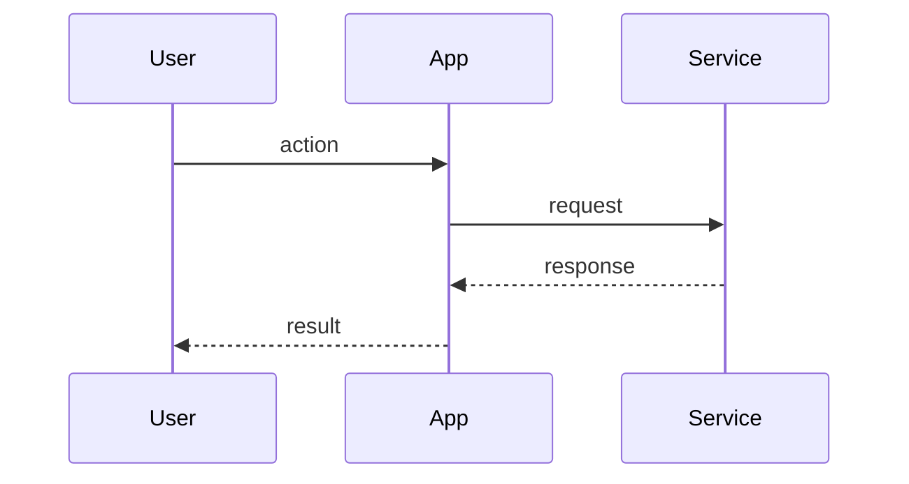

# Create Pull Request

Create a GitHub pull request from the current branch into base branch `$1`.
Optionally use GitHub issue `$2` for richer context.

## Validation

If `$1` is empty, STOP and say exactly:

`Usage: /pr <base-branch> [github-issue]`

If `git status --porcelain` is not empty, STOP and say exactly:

`Uncommitted changes; commit or stash before PR.`

If the current branch is the base branch, STOP and say exactly:

`Current branch matches base branch; cannot create PR.`

## Context to inspect

- Current branch: `git branch --show-current`
- Dirty state: `git status --porcelain`
- Existing PR check: `gh pr view --head <current-branch>`
- After fetch, compare: `git diff --stat $1...HEAD` and `git diff $1...HEAD`
- After fetch, commits: `git log --oneline $1..HEAD`
- If `$2` is provided: `gh issue view "$2" --comments --json number,title,body,labels,url,comments`

If an existing PR is found for the current branch, output only its URL and stop.
If `$2` is provided but cannot be read, STOP and report the `gh issue view` failure.

## Task

1. Fetch the base branch if needed: `git fetch origin $1`.
2. Push the current branch to its upstream.
   - If no upstream exists, push with upstream tracking.
3. Write a concise PR title.
   - Prefer the issue title when `$2` is provided and matches the diff.
   - Otherwise summarize the actual branch diff.
4. Write a PR body to a temp file.
5. Create the PR:

```bash
gh pr create --base "$1" --head "<current-branch>" --title "<title>" --body-file "<temp-file>"
```

## PR body format

Use this CodeRabbit-style structure, without bot metadata, poems, tips, or review-effort scoring:

````markdown
## Walkthrough

Explain the PR as a short narrative: what changed, why, and the main runtime/user-visible effect. Use issue context when provided.

## Changes

**Short theme of the PR**

| Layer / File(s) | Summary |
|---|---|
| **Area name** <br> `path/or/glob` | Explain the meaningful change, not line-by-line edits. |

## Sequence Diagram(s)



## Validation
- List checks actually run if known from branch context.
- Otherwise write `Not run`.

Closes #123
````

Only include `## Sequence Diagram(s)` when it clarifies a workflow, architecture, data flow, or state transition. Skip it for simple copy/config/test-only changes.
Only include `Closes #123` or `Refs #123` when an issue was provided and the diff supports that relationship.

## Output

After creation, output only the PR URL.
