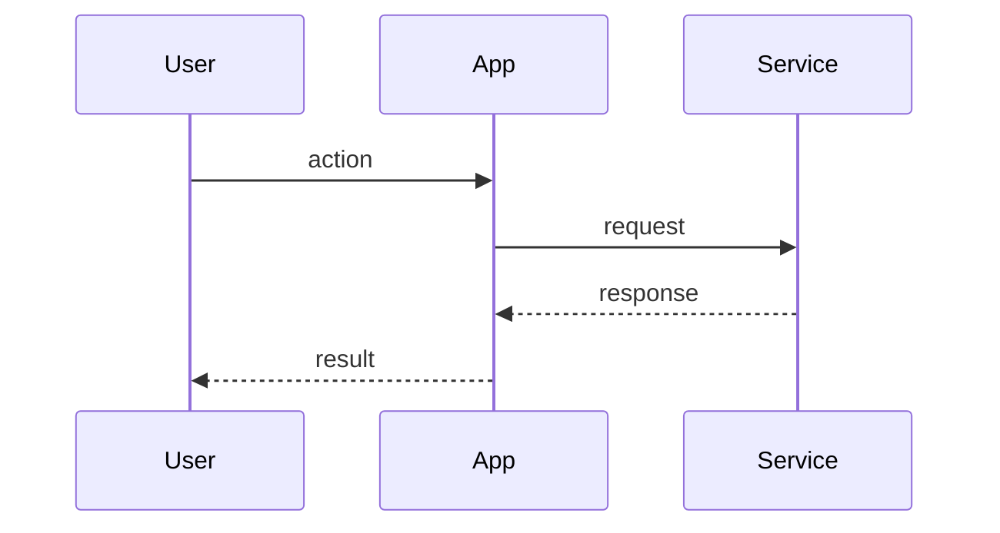

# Create pull request

Create a GitHub pull request from the current branch into the base branch supplied by the user. The user may also supply a GitHub issue for context.

## Inputs

Interpret the first argument as the base branch and the optional second argument as the GitHub issue.

If the base branch is missing, stop and say exactly:

`Usage: /skill:create-pr <base-branch> [github-issue]`

## Validation

If `git status --porcelain` is not empty, stop and say exactly:

`Uncommitted changes; commit or stash before PR.`

If the current branch is the base branch, stop and say exactly:

`Current branch matches base branch; cannot create PR.`

## Inspect context

- Current branch: `git branch --show-current`
- Dirty state: `git status --porcelain`
- Existing PR: `gh pr view --head <current-branch>`
- After fetching, diff: `git diff --stat <base-branch>...HEAD` and `git diff <base-branch>...HEAD`
- After fetching, commits: `git log --oneline <base-branch>..HEAD`
- If an issue was provided: `gh issue view "<github-issue>" --comments --json number,title,body,labels,url,comments`

If an existing PR is found for the current branch, output only its URL and stop.

If an issue was provided but cannot be read, stop and report the `gh issue view` failure.

## Create the PR

1. Fetch the base branch: `git fetch origin <base-branch>`.
2. Push the current branch to its upstream. If no upstream exists, push with upstream tracking.
3. Write a concise PR title.
   - Prefer the issue title when an issue was provided and it matches the diff.
   - Otherwise summarize the actual branch diff.
4. Write the PR body to a temporary file.
5. Create the PR:

```bash
gh pr create --base "<base-branch>" --head "<current-branch>" --title "<title>" --body-file "<temp-file>"
```

Clean up the temporary file after `gh pr create` completes.

## PR body format

Use this CodeRabbit-style structure. Do not include bot metadata, poems, tips, or review-effort scoring.

````markdown
## Walkthrough

Explain the PR as a short narrative: what changed, why, and the main runtime or user-visible effect. Use issue context when provided.

## Changes

**Short theme of the PR**

| Layer / File(s) | Summary |
|---|---|
| **Area name** <br> `path/or/glob` | Explain the meaningful change, not line-by-line edits. |

## Sequence diagrams



## Validation
- List checks actually run if known from branch context.
- Otherwise write `Not run`.

Closes #123
````

Only include `## Sequence diagrams` when it clarifies a workflow, architecture, data flow, or state transition. Skip it for simple copy, configuration, or test-only changes.

Only include `Closes #123` or `Refs #123` when an issue was provided and the diff supports that relationship.

## Output

After creation, output only the PR URL.
